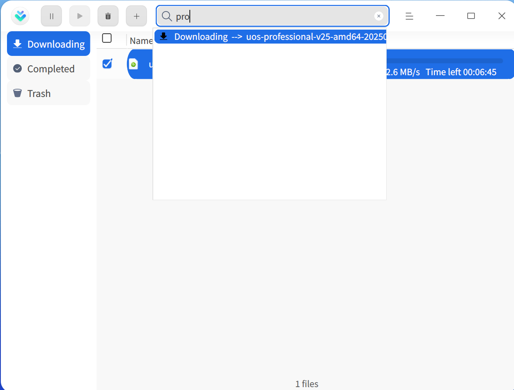

# Downloader | downloader

## Overview

Downloader is a simple and easy-to-use network resource download tool that supports multiple network download protocols.

## Getting Started

You can run or close the Downloader, or create shortcuts through the following methods.

### Running Downloader

1. Click the Launcher icon  on the taskbar to enter the Launcher interface.
2. Scroll the mouse wheel or search to locate the Downloader icon , then click to run.
3. Right-click  to:
   - Click **Send to Desktop** to create a desktop shortcut.
   - Click **Pin to Taskbar** to pin the application to the taskbar.
   - Click **Start on Boot** to add the application to startup items, automatically running when the computer starts.

### Closing Downloader

- Click  in the Downloader interface to exit.
- Right-click the  icon on the taskbar and select **Close All** to exit Downloader.
- Click  in the Downloader interface and select **Exit** to exit Downloader.

## Operations Guide
### Adding Tasks

#### Adding Tasks via Download Links

1. In the Downloader interface, click the add task button  to open the New Download Task window.

   

2. Enter the download address, select the file to download, type, and storage path, then click **OK** to successfully create the task.

   > Note: When adding multiple links simultaneously, ensure each line contains only one link.

#### Creating Download Tasks via Torrent Files

1. Create download tasks via torrent files using the following three methods:
   - Double-click a torrent file to open the New Download Task window. If the "Associate Torrent Files" feature is disabled in the main menu settings, double-clicking a torrent file will not create a download task.
   - Drag and drop a torrent file into the address box in the New Download Task interface.
   - Click  in the New Download Task interface, open the file manager, and select the desired torrent file.
2. After selecting the file to download, type, and storage path, click **Download Now** to successfully create the task.

#### Creating Download Tasks via MetaLink Files

1. Create download tasks via MetaLink files using the following three methods:
   - Double-click a MetaLink file to open the New Download Task window. If the "Associate MetaLink Files" feature is disabled in the main menu settings, double-clicking a MetaLink file will not create a download task.
   - Drag and drop a MetaLink file into the address box in the New Download Task interface.
   - Click  in the New Download Task interface, open the file manager, and select a MetaLink file.
2. After selecting the file to download, type, and storage path, click **Download Now** to successfully create the task.

### Searching Tasks

In the Downloader interface, click the search button , and enter keywords to search for related download tasks.

### Downloading

View the list of downloading tasks, including task name, size, and status. You can also perform operations on selected tasks. Below are the operation items for a single task.

> Note: Operation items differ for single and multiple selected tasks; actual conditions apply.

**Pause**: Click the pause button  or right-click and select **Pause** to pause file download.

**Start**: To continue downloading, click the start button  or right-click and select **Start** to resume downloading previously paused files.

**Priority Download**: If the current number of download tasks exceeds the set maximum, tasks that haven't started downloading (queued or paused) will have the "Priority Download" option. For details on setting the maximum download tasks, see [Task Management](#任务管理).

**Delete**: Click the delete button  or right-click and select **Delete** to delete downloading files. Deleted files are moved to the recycle bin. If **Also delete local file** is checked, the local file will also be deleted.

**Delete Permanently**: Right-click and select to permanently delete selected files; local files will also be deleted.

**Copy Download Link**: Right-click and select to copy the download link.

**Open Folder**: Right-click and select to jump to the folder containing the downloaded file.

### Download Completed

View the list of completed files, including file name, size, and completion time. You can also perform operations on selected tasks. Below are the operation items for a single task.

> Note: Operation items differ for single and multiple selected tasks; actual conditions apply.

**Redownload**: Right-click and select to redownload the file and delete the original file.

**Open**: Click the open button  or right-click and select **Open** to open the file.

**Open Folder**: Click the open folder button  or right-click and select **Open Folder** to jump to the folder containing the file.

**Rename**: Right-click and select to rename the downloaded file.

**Move to Folder**: Right-click and select to move the downloaded file to a specified folder.

**Delete**: Click the delete button  or right-click and select **Delete** to delete downloaded files. Deleted files are moved to the recycle bin. If **Also delete local file** is checked, the local file will also be deleted.

**Delete Permanently**: Right-click and select to permanently delete selected files; local files will also be deleted.

**Copy Download Link**: Right-click and select to copy the download link.

### Download Failed

When file download fails, you can try redownloading. If download fails again, it may be due to download link issues, insufficient storage space, or no network connection; actual conditions apply.

### Recycle Bin

View the list of deleted files, including file name, size, and deletion time. You can also perform operations on selected tasks. Below are the operation items for a single task.

> Note: Operation items differ for single and multiple selected tasks; actual conditions apply.

**Restore**: Click the restore button  or right-click and select **Restore** to restore deleted files. Restored files will be moved to the download completed list.

**Redownload**: Right-click and select to redownload the file.

**Open**: Right-click and select to open the file.

**Open Folder**: Right-click and select to jump directly to the folder containing the file.

**Copy Download Link**: Right-click and select to copy the download link for redownloading or sharing with others.

**Delete**: Click the delete button  or right-click and select **Delete** to delete files in the recycle bin. If **Also delete local file** is checked, the local file will also be deleted.

**Delete Permanently**: Right-click and select to permanently delete selected files; local files will also be deleted.

**Empty**: Click the empty button  to clear all files in the recycle bin.

## Main Menu

In the main menu, you can perform download settings, use download diagnostic tools, switch window themes, view help manuals, etc.

### Settings
#### Basic Settings

**Startup**: Mainly sets program startup related items.
- Start on Boot: Enable to automatically start Downloader when the computer boots.
- Automatically start unfinished tasks after startup: Enable to automatically start unfinished tasks in the downloading list when Downloader starts.

**Download Directory**: Mainly sets download directory related items.
- Set default directory: Select a folder from the file manager as the default download path. All subsequent download tasks will use this path by default.
- Last used directory: The download path defaults to the path selected during the last download when creating a new download task.

**One-click Download**: Enable to create new tasks directly without opening the Downloader interface when clicking download links or opening torrent files.

**Close Main Window**:
- Select **Minimize to system tray** to hide the application to the system tray when closing the main window.
- Select **Exit** to exit the application directly when closing the main window.
- Select **Ask every time** to display a confirmation dialog each time the main window is closed.

#### Task Management

Mainly sets download tasks, including the maximum number of simultaneous downloads, automatically opening after download completion, automatically moving low-speed tasks to the end of the queue, etc.

#### Download Settings

**Download Management**: Set the number of original address threads (range 1-10). The default global maximum simultaneous download resources is 500; can be customized after enabling.

**Speed Settings**: Choose full-speed download or speed-limited download. Speed-limited download allows setting maximum download speed, maximum upload speed, and speed-limited time periods.

#### Takeover Settings

**Applications**: Currently supports clipboard and browser takeover. Only effective when enabled. When a download link is copied to the clipboard or clicked in a browser, Downloader starts and automatically creates a download task.

**Takeover Download Types**: Can only be selected when there is a takeover target. Currently supports HTTP downloads, MetaLink, torrent downloads, and magnet links. Only when the copied or clicked link is of the selected type will a download task be created.

Click **Advanced Settings** next to HTTP download to edit download file extensions and non-takeover websites.

**Torrent Association**:
- Automatically open download panel after downloading torrent files: Disabled by default. When enabled, automatically starts Downloader and creates a download task when downloading torrent files.
- Associate torrent files: Enabled by default. Double-clicking a torrent file opens the New Download Task window to select file types for download.

**MetaLink Association**:
- Automatically open download panel after downloading MetaLink files: Disabled by default. When enabled, automatically starts Downloader and creates a download task when downloading MetaLink files.
- Associate MetaLink files: Enabled by default. Double-clicking a MetaLink file opens the New Download Task window to select file types for download.

#### Notification Reminders

When task status changes, system notifications remind you of the status change content. For specific operations, see [Notification Settings](dman:///dde#通知设置).

#### Advanced Settings

Set the size of the download disk cache. Larger disk cache results in faster download speeds but consumes more computer resources.

#### Restore Defaults

Click **Restore Defaults** to restore default settings.

### After Download Completion

After download completion, you can choose to **Shut Down**, **Hibernate**, or **Exit**. For example, to avoid network usage peaks, you can create download tasks before leaving work and set automatic shutdown after download completion.

### Diagnostic Tools

Diagnose whether IPv6 protocol is supported, DHT network status, download type task information, and network environment.

### Theme

Window themes include Light, Dark, and System.
1. In the Downloader interface, click .
2. Click **Theme** and select a theme color.

### Help

1. In the Downloader interface, click .
2. Click **Help** to view the help manual and learn more about using Downloader.

### About

1. In the Downloader interface, click .
2. Click **About** to view the version and introduction of Downloader.

### Exit

1. In the Downloader interface, click .
2. Click **Exit**.