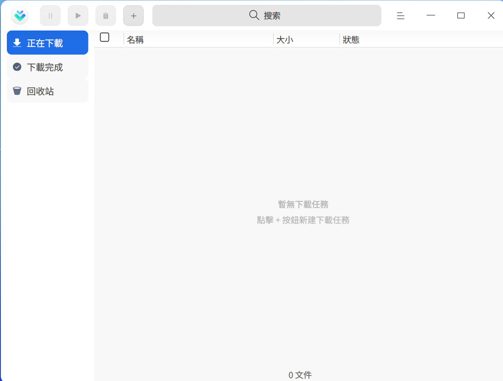
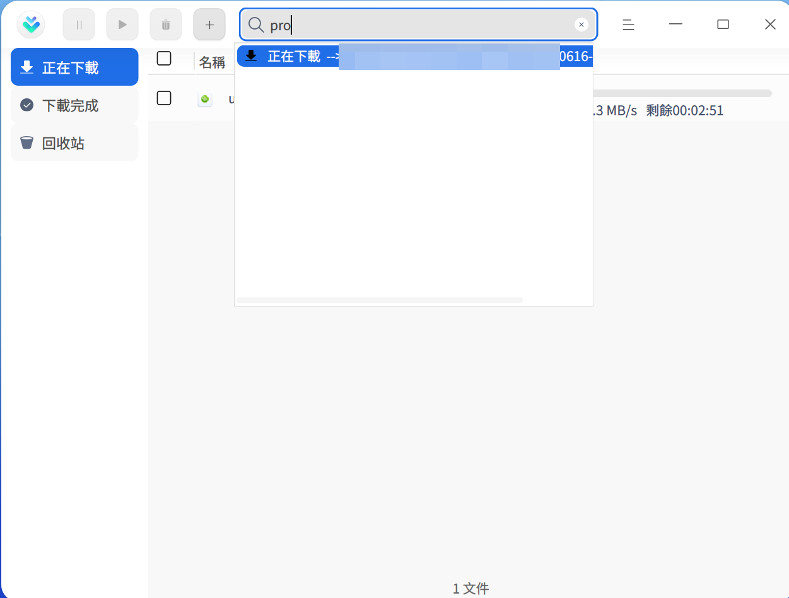
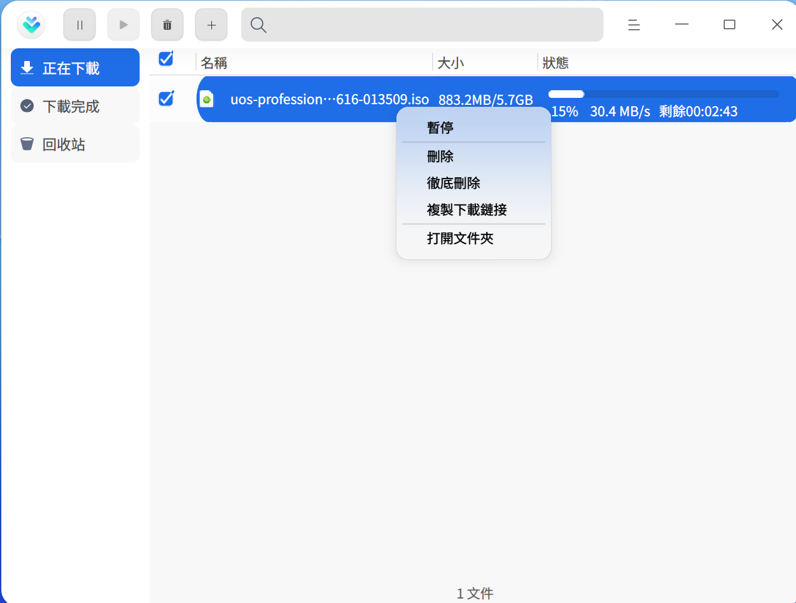
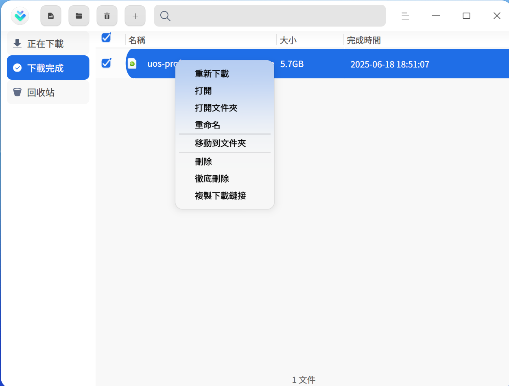
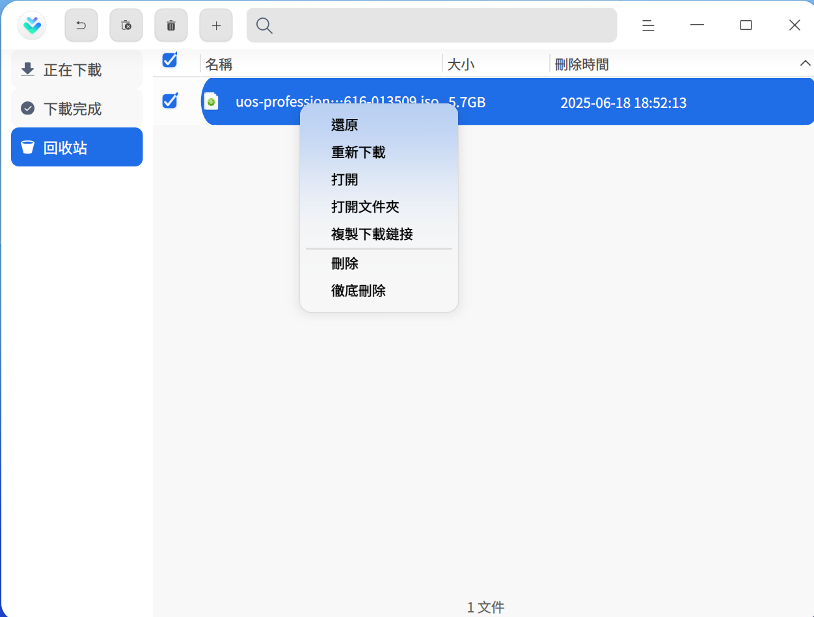

# 下載器 | downloader

## 概述

下載器是一個簡單易用的網絡資源下載工具，支援多種網絡下載協議。

## 使用入門

您可以透過以下方式執行或關閉下載器，或者建立捷徑。

### 執行下載器

1. 按一下工作列上的啟動器圖示 ，進入啟動器介面。
2. 滾動滑鼠或搜尋，找到下載器圖示 ，按一下執行。
3. 右鍵按一下 ，您可以：
   - 按一下 **傳送到桌面**，在桌面建立捷徑。
   - 按一下 **釘選到工作列**，將應用程式固定到工作列。
   - 按一下 **開機自動啟動**，將應用程式加入到開機啟動項，在電腦開機時自動執行該應用程式。

### 關閉下載器

- 在下載器介面，按一下 ，退出下載器。
- 右鍵按一下工作列上的  圖示，選擇 **全部關閉** 來退出下載器。
- 在下載器介面按一下 ，選擇 **退出** 來退出下載器。

## 操作介紹
### 新增任務

#### 透過下載連結新增任務

1. 在下載器介面按一下新增任務按鈕 ，彈出新增下載任務視窗。

   

2. 輸入下載地址，並選擇下載的檔案、類型及儲存路徑後，按一下 **確定**，則任務建立成功。

   > 說明：同時新增多個連結時，確保每行只有一個連結。

#### 透過BT種子檔案建立下載任務

1. 透過BT種子檔案建立下載任務，有以下三種方式：
   - 雙按BT種子檔案時，彈出新增下載任務視窗。如果主選單設定介面中「關聯BT種子檔案」功能關閉，雙按BT種子檔案時就不會建立下載任務。
   - 在新增下載任務介面，將BT種子檔案拖拽到地址框。
   - 在新增下載任務介面按一下 ，彈出檔案管理器視窗，選擇需要的BT種子檔案。
2. 選擇下載的檔案、類型及儲存路徑後，按一下 **立即下載**，則任務建立成功。

#### 透過MetaLink檔案建立下載任務

1. 透過MetaLink檔案建立下載任務，有以下三種方式：
   - 雙按MetaLink檔案時，彈出新增下載任務視窗。如果主選單設定介面中「關聯MetaLink種子檔案」功能關閉，雙按MetaLink檔案時就不會建立下載任務。
   - 在新增下載任務介面，將MetaLink檔案拖拽到地址框。
   - 在新增下載任務介面按一下 ，彈出檔案管理器視窗，選擇MetaLink檔案。
2. 選擇下載的檔案、類型及儲存路徑後，按一下 **立即下載**，則任務建立成功。

### 搜尋任務

在下載器介面，按一下搜尋按鈕 ，輸入關鍵字搜尋相關下載任務。

### 正在下載

查看正在下載的任務清單，包括任務名稱、大小及狀態。還可以對勾選的任務進行操作，以下介紹單個任務的操作項。

> 說明：勾選單個和多個任務的操作項不同，請以實際情況為準。

**暫停**：按一下暫停按鈕  或右鍵選擇 **暫停** 後，檔案暫停下載。

**開始**：如果想要繼續下載，按一下開始按鈕  或右鍵選擇 **開始** 後，之前暫停的下載檔案則會繼續下載。

**優先下載**：如果目前下載任務數大於設定的最大下載任務數，未開始下載（排隊及暫停狀態）的任務才有「優先下載」的選項。設定最大下載任務數的詳細操作請參閱 [任務管理](#任务管理)。

**刪除**：按一下刪除按鈕  或右鍵選擇 **刪除** 後，刪除正在下載的檔案，被刪除的檔案會被放到回收站。如果勾選 **同時刪除本地檔案**，本地檔案也將被刪除。

**徹底刪除**：右鍵選中後，將會徹底刪除勾選的檔案，同時本地檔案也將被刪除。

**複製下載連結**：右鍵選中後，複製下載連結。

**開啟資料夾**：右鍵選中後，跳轉到下載檔案所在的資料夾。

### 下載完成

查看下載完成的檔案清單，包括檔案名稱、大小及完成時間。還可以對勾選的任務進行操作，以下介紹單個任務的操作項。

> 說明：勾選單個和多個任務的操作項不同，請以實際情況為準。

**重新下載**：右鍵選中後，重新下載該檔案，並刪除原來的檔案。

**開啟**：按一下開啟按鈕  或右鍵選擇 **開啟** 後，開啟該檔案。

**開啟資料夾**：按一下開啟資料夾按鈕  或右鍵選擇 **開啟資料夾** 後，跳轉到檔案所在的資料夾。

**重新命名**：右鍵選中後，對下載的檔案重新命名。

**移動到資料夾**：右鍵選中後，將下載的檔案移動到指定的資料夾。

**刪除**：按一下刪除按鈕  或右鍵選擇 **刪除** 後，可刪除已下載的檔案，被刪除的檔案會被放到回收站。如果勾選 **同時刪除本地檔案**，本地檔案也將被刪除。

**徹底刪除**：右鍵選中後，將會徹底刪除勾選的檔案，同時本地檔案也將被刪除。

**複製下載連結**：右鍵選中後，複製下載連結。

### 下載失敗

當檔案下載失敗時，可以嘗試重新下載。如果再次下載失敗，可能是下載連結問題、儲存路徑空間不夠或無網絡等原因，具體以實際情況為準。

### 回收站

查看被刪除的檔案清單，包括檔案名稱、大小及刪除時間。還可以對勾選的任務進行操作，以下介紹單個任務的操作項。

> 說明：勾選單個和多個任務的操作項不同，請以實際情況為準。

**還原**：按一下還原按鈕  或右鍵選擇 **還原** 後，還原被刪除的檔案，還原後的檔案會被放到下載完成清單中。

**重新下載**：右鍵選中後，重新下載該檔案。

**開啟**：右鍵選中後，開啟該檔案。

**開啟資料夾**：右鍵選中後，直接跳轉到檔案所在的資料夾。

**複製下載連結**：右鍵選中後，可複製下載連結重新下載或共享給其他人。

**刪除**：按一下刪除按鈕  或右鍵選擇 **刪除** 後，刪除回收站中的檔案。如果勾選 **同時刪除本地檔案**，本地檔案也將被刪除。

**徹底刪除**：右鍵選中後，將會徹底刪除勾選的檔案，同時本地檔案也將被刪除。

**清空**：按一下清空按鈕 後，清空回收站中的所有檔案。

## 主選單

在主選單中，可以進行下載設定、使用下載診斷工具、切換視窗主題、查看說明手冊等操作。

### 設定
#### 基本設定

**啟動**：主要設定程式啟動的相關項。
- 開機啟動：開啟此項後，當電腦開機時，自動啟動下載器程式。
- 啟動後自動開始未完成的任務：開啟此項後，每當啟動下載器時，自動開始正在下載清單中沒有下載完的任務

**下載目錄**：主要設定下載目錄的相關項。
- 設定預設目錄：從檔案管理器中選擇一下資料夾，作為預設下載路徑，此後每次建立下載任務時，都以此路徑為預設下載路徑。
- 上次使用目錄：建立下載任務時，下載路徑預設為上次下載時選擇的路徑。

**一鍵下載**：開啟一鍵建立新任務功能後，按一下下載連結或開啟BT檔案時，不彈出下載器介面，直接建立下載任務。

**關閉主視窗**：
- 選擇 **最小化到系統托盤**，關閉主視窗時，應用將隱藏到系統托盤。
- 選擇 **退出**，關閉主視窗時直接退出應用。
- 選擇**每次詢問**，每次關閉主視窗時會彈出確認彈框。

#### 任務管理

主要對下載的任務進行設定，可以選擇同時下載最大任務數，下載完成後自動開啟、自動將低速任務移動至隊尾等。

#### 下載設定

**下載管理**：設定原始地址執行緒數，選擇範圍是1～10。全域最大同時下載資源數預設為500，開啟後可以自行設定。

**速度設定**：選擇全速下載或限速下載，限速下載可以設定最大下載限速、最大上傳限速和限速時段。

#### 接管設定

**應用程式**：目前支援的接管對象為剪貼簿和瀏覽器，只有開啟開關時，才會生效。當有下載連結被複製到剪貼簿或在瀏覽器按一下下載連結時，啟動下載器並自動建立下載任務。

**接管下載類型**：在有接管對象的時候才能選擇接管下載類型，目前支援 HTTP下載、MetaLink、BT下載和磁力鏈下載。只有當複製或按一下的連結為選中的類型時，才會建立下載任務。

按一下HTTP下載旁邊的 **進階設定**，可以編輯下載檔案副檔名及不接管的網站。

**BT關聯**：
- 下載種子檔案後自動開啟下載面板：此功能預設關閉。開啟後，當下載BT種子檔案時，自動啟動下載器並建立下載任務。
- 關聯BT種子檔案：此功能預設開啟，雙按BT種子檔案時，彈出新增下載任務視窗，選擇下載的檔案類型。

**MetaLink關聯**：
- 下載MetaLink檔案後自動開啟下載面板：此功能預設關閉。開啟後，當下載MetaLink檔案時，自動啟動下載器並建立下載任務。
- 關聯MetaLink檔案：此功能預設開啟，雙按MetaLink檔案時，彈出新增下載任務視窗，選擇下載的檔案類型。

#### 通知提醒

當有任務狀態變更時，透過系統通知來提醒您任務狀態變更內容，具體操作請參閱 [通知設定](dman:///dde#通知设置)。

#### 進階設定

設定下載磁碟快取的大小，磁碟快取越大，下載速度越快，佔用電腦資源越多。

#### 恢復預設

按一下 **恢復預設**，恢復預設設定。

### 下載完成後

下載完成後，可以選擇 **關機**、**休眠** 或 **退出**。例如為了避開網絡使用高峰，可以在下班前建立下載任務，並設定下載完成後自動關機。

### 診斷工具

診斷是否支援IPv6協議、DHT網絡狀態、下載類型任務資訊及網絡環境。

### 主題

視窗主題包含淺色主題、深色主題和系統主題。
1. 在下載器介面，按一下 。
2. 按一下 **主題**，選擇一個主題顏色。

### 說明

1. 在下載器介面，按一下 。
2. 按一下 **說明**，查看下載器的說明手冊，進一步了解和使用下載器。

### 關於

1. 在下載器介面，按一下 。
2. 按一下 **關於**，查看下載器的版本和介紹。

### 退出

1. 在下載器介面，按一下 。
2. 按一下 **退出**。