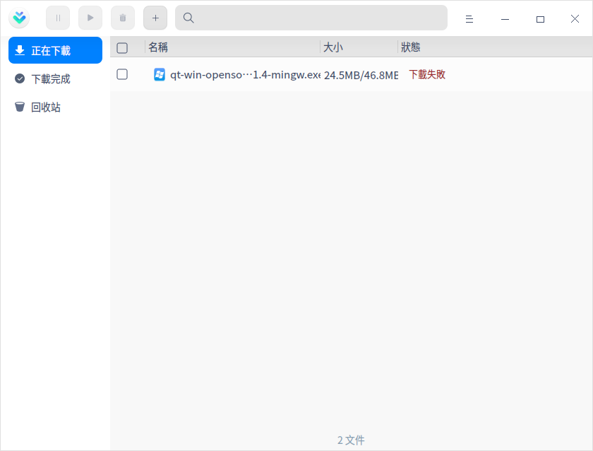
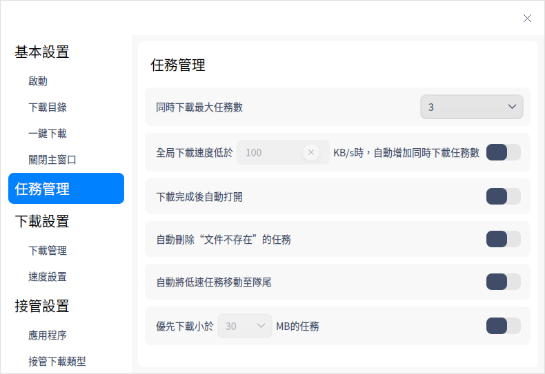
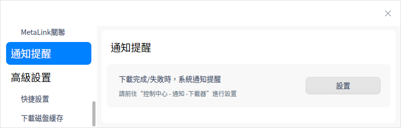

# 下載器|downloader|

## 概述

下載器是一個簡單易用的網絡資源下載工具，支持多種網絡下載協議。

## 使用入門

您可以通過以下方式運行或關閉下載器，或者創建快捷方式。

### 運行下載器

1. 單擊任務欄上的啟動器圖標 ，進入啟動器界面。
2. 上下滾動鼠標滾輪瀏覽或通過搜索，找到下載器圖標    ，單擊運行  。
3. 右鍵單擊 ，您可以：
   - 單擊 **發送到桌面**，在桌面創建快捷方式。

   - 單擊 **發送到任務欄**，將應用程序固定到任務欄。

   - 單擊 **開機自動啟動**，將應用程序添加到開機啟動項，在電腦開機時自動運行該應用程序。

### 關閉下載器

- 在下載器界面，單擊   ，退出下載器。
- 右鍵單擊任務欄上的 圖標，選擇 **關閉所有** 來退出下載器。
- 在下載器界面單擊  ，選擇 **退出** 來退出下載器。

## 操作介紹

### 添加任務

#### 通過下載鏈接添加任務

1. 在下載器界面單擊添加任務按鈕，彈出新建下載任務窗口。

   

2. 輸入下載地址，並選擇下載的文件、類型及存儲路徑後，單擊 **確定**，則任務創建成功。

   > 說明：同時添加多個鏈接時，確保每行只有一個鏈接。

#### 通過BT種子文件創建下載任務

1. 通過BT種子文件創建下載任務，有以下三種方式：

   - 雙擊BT種子文件時，彈出新建下載任務窗口。如果主菜單設置界面中「關聯BT種子文件」功能關閉，雙擊BT種子文件時就不會創建下載任務。
   - 在新建下載任務界面，將BT種子文件拖拽到地址框。
   - 在新建下載任務界面單擊 ，彈出文件管理器窗口，選擇需要的BT種子文件。
2. 選擇下載的文件、類型及存儲路徑後，單擊 **立即下載**，則任務創建成功。

#### 通過MetaLink文件創建下載任務

1. 通過MetaLink文件創建下載任務，有以下三種方式：

   - 雙擊MetaLink文件時，彈出新建下載任務窗口。如果主菜單設置界面中「關聯MetaLink種子文件」功能關閉，雙擊MetaLink文件時就不會創建下載任務。

   - 在新建下載任務界面，將MetaLink文件拖拽到地址框。
   - 在新建下載任務界面單擊 ，彈出文件管理器窗口，選擇MetaLink文件。

2. 選擇下載的文件、類型及存儲路徑後，單擊 **立即下載**，則任務創建成功。

### 搜索任務

在下載器界面，單擊搜索按鈕，輸入關鍵字搜索相關下載任務。

### 正在下載

查看正在下載的任務列表，包括任務名稱、大小及狀態。還可以對勾選的任務進行操作，以下介紹單個任務的操作項。

>  說明：勾選單個和多個任務的操作項不同，請以實際情況為準。

**暫停**：單擊暫停按鈕  或右鍵選擇 **暫停** 後，文件暫停下載。

**開始**：如果想要繼續下載，單擊開始按鈕   或右鍵選擇 **開始** 後，之前暫停的下載文件則會繼續下載。

**優先下載**：如果當前下載任務數大於設置的最大下載任務數，未開始下載（排隊及暫停狀態）的任務才有「優先下載」的選項。設置最大下載任務數的詳細操作請參閱 [任務管理](#任務管理)。

**刪除**：單擊刪除按鈕  或右鍵選擇 **刪除** 後，刪除正在下載的文件，被刪除的文件會被放到回收站。如果勾選 **同時刪除本地文件**，回收站中則不會出現此文件，且本地文件也將被刪除。

**徹底刪除**：右鍵選中後，將會徹底刪除勾選的文件，同時本地文件也將被刪除。

**複製下載鏈接**：右鍵選中後，複製下載鏈接。

**打開文件夾**：右鍵選中後，跳轉到下載文件所在的文件夾。

### 下載完成

查看下載完成的文件列表，包括文件名、大小及完成時間。還可以對勾選的任務進行操作，以下介紹單個任務的操作項。

> 說明：勾選單個和多個任務的操作項不同，請以實際情況為準。

**重新下載**：右鍵選中後，重新下載該文件，並刪除原來的文件。

**打開**：單擊打開按鈕  或右鍵選擇 **打開** 後，打開該文件。

**打開文件夾**：單擊打開文件夾按鈕  或右鍵選擇 **打開文件夾** 後，跳轉到文件所在的文件夾。

**重命名**：右鍵選中後，對下載的文件重命名。

**移動到文件夾**：右鍵選中後，將下載的文件移動到指定的文件夾。

**刪除**：單擊刪除按鈕  或右鍵選擇 **刪除** 後，刪除已下載的文件，被刪除的文件會被放到回收站。如果勾選 **同時刪除本地文件**，回收站中則不會出現此文件，且本地文件也將被刪除。

**徹底刪除**：右鍵選中後，將會徹底刪除勾選的文件，同時本地文件也將被刪除。

**複製下載鏈接**：右鍵選中後，複製下載鏈接。

### 下載失敗

當文件下載失敗時，可以嘗試重新下載。如果再次下載失敗，可能是下載鏈接問題、存儲路徑空間不夠或無網絡等原因，具體以實際情況為準。

### 回收站 

查看被刪除的文件列表，包括文件名、大小及刪除時間。還可以對勾選的任務進行操作，以下介紹單個任務的操作項。

> 說明：勾選單個和多個任務的操作項不同，請以實際情況為準。

**還原**：單擊還原按鈕  或右鍵選擇 **還原** 後，還原被刪除的文件，還原後的文件會被放到下載完成列表中。

**重新下載**：右鍵選中後，重新下載該文件。

**打開**：右鍵選中後，打開該文件。

**打開文件夾**：右鍵選中後，跳轉到文件所在的文件夾。

**複製下載鏈接**：右鍵選中後，複製下載鏈接。

**刪除**：單擊刪除按鈕  或右鍵選擇 **刪除** 後，刪除回收站中的文件。如果勾選 **同時刪除本地文件**，本地文件也將被刪除。

**徹底刪除**：右鍵選中後，將會徹底刪除勾選的文件，同時本地文件也將被刪除。

**清空**：單擊清空按鈕 後，清空回收站中的所有文件。

## 主菜單

在主菜單中，可以進行下載設置、使用下載診斷工具、切換窗口主題、查看幫助手冊等操作。

### 設置
#### 基本設置

**啟動**：主要設置程序啟動的相關項。

- 開機啟動：開啟此項後，當電腦開機時，自動啟動下載器程序。
- 啟動後自動開始未完成的任務：開啟此項後，每當啟動下載器時，自動開始正在下載列表中沒有下載完的任務

**下載目錄**：主要設置下載目錄的相關項。

- 設置默認目錄：從文件管理器中選擇一下文件夾，作為默認下載路徑，此後每次創建下載任務時，都以此路徑為默認下載路徑。
- 上次使用目錄：創建下載任務時，下載路徑默認為上次下載時選擇的路徑 。

**一鍵下載**：開啟一鍵創建新任務功能後，單擊下載鏈接或打開BT文件時，不彈出下載器界面，直接建立下載任務。

**關閉主窗口**：

- 選擇 **最小化到系統托盤**，關閉主窗口時，應用將隱藏到系統托盤。
- 選擇 **退出**，關閉主窗口時直接退出應用。
- 選擇**每次詢問**，每次關閉主窗口時會彈出確認彈框。

#### 任務管理

主要對下載的任務進行設置，可以選擇同時下載最大任務數，下載完成後自動打開、自動將低速任務移動至隊尾等。

#### 下載設置

**下載管理**：設置原始地址線程數，選擇範圍是1～10。全局最大同時下載資源數默認為500，開啟後可以自行設置。

**速度設置**：選擇全速下載或限速下載，限速下載可以設置最大下載限速、最大上傳限速和限速時段。

#### 接管設置

**應用程序**：當前支持的接管對象為剪切板和瀏覽器，只有開啟開關時，才會生效。當有下載鏈接被複製到剪貼板或在瀏覽器單擊下載鏈接時，啟動下載器並自動創建下載任務。

**接管下載類型**：在有接管對象的時候才能選擇接管下載類型，當前支持 HTTP下載、MetaLink、BT下載和磁力鏈下載。只有當複製或單擊的鏈接為選中的類型時，才會創建下載任務。

單擊HTTP下載旁邊的 **高級設置**，可以編輯下載文件擴展名及不接管的網站。

**BT關聯**：

- 下載種子文件後自動打開下載面板：此功能默認關閉。開啟後，當下載BT種子文件時，自動啟動下載器並創建下載任務。
- 關聯BT種子文件：此功能默認開啟，雙擊BT種子文件時，彈出新建下載任務窗口，選擇下載的文件類型。

**MetaLink關聯**：

- 下載MetaLink文件後自動打開下載面板：此功能默認關閉。開啟後，當下載MetaLink文件時，自動啟動下載器並創建下載任務。
- 關聯MetaLink文件：此功能默認開啟，雙擊MetaLink文件時，彈出新建下載任務窗口，選擇下載的文件類型。

#### 通知提醒

當有任務狀態變更時，通過系統通知來提醒您任務狀態變更內容 ，具體操作請參閱 [通知設置](dman:///dde#通知設置)。

#### 高級設置

設置下載磁盤緩存的大小，磁盤緩存越大，下載速度越快，佔用電腦資源越多。

#### 恢復默認

單擊 **恢復默認** ，恢復默認設置。

### 下載完成後

下載完成後，可以選擇 **關機**、**休眠** 或 **退出**。例如為了錯開網絡使用高峰，可以在下班前創建下載任務，並設置下載完成後自動關機。

### 診斷工具

診斷是否支持IPv6協議、DHT網絡狀態、下載類型任務訊息及網絡環境。

### 主題

窗口主題包含淺色主題、深色主題和系統主題。

1. 在下載器界面，單擊。
2. 單擊 **主題**，選擇一個主題顏色。

### 幫助

1. 在下載器界面，單擊 。
2. 單擊 **幫助**，查看下載器的幫助手冊，進一步了解和使用下載器。

### 關於

1. 在下載器界面，單擊 。
2. 單擊 **關於**，查看下載器的版本和介紹。

### 退出

1. 在下載器界面，單擊 。
2. 單擊 **退出**。

