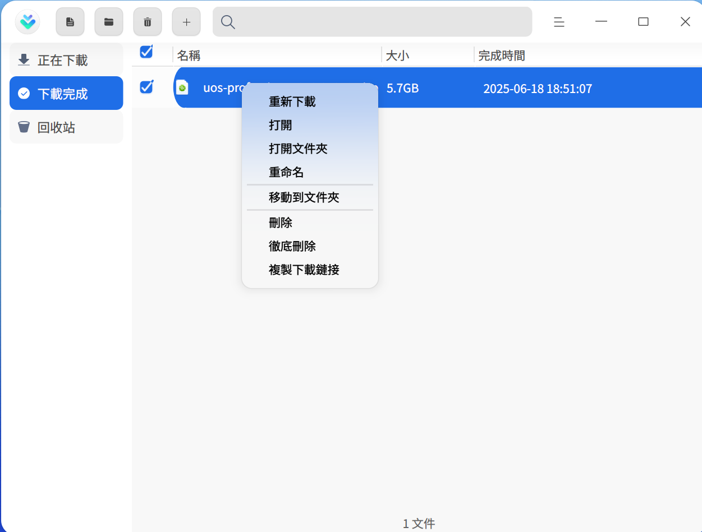
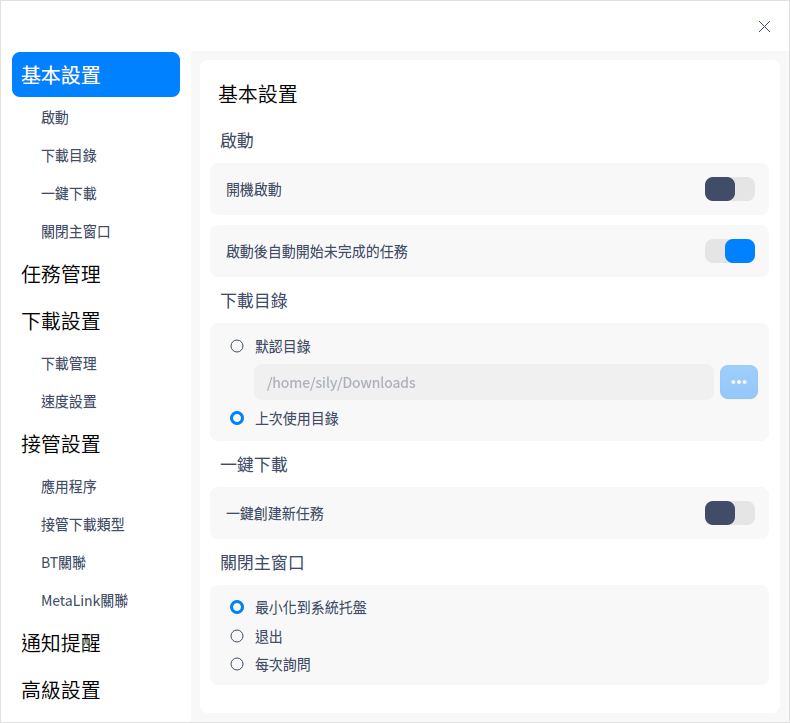
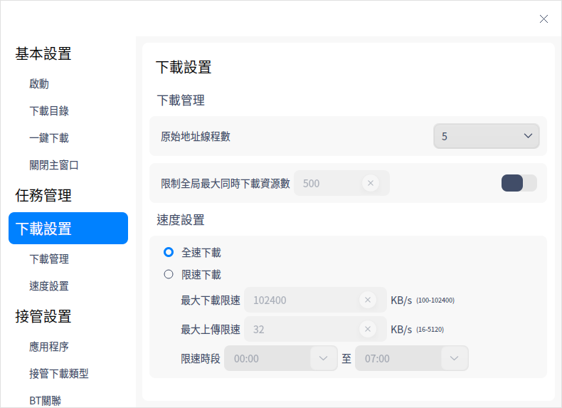
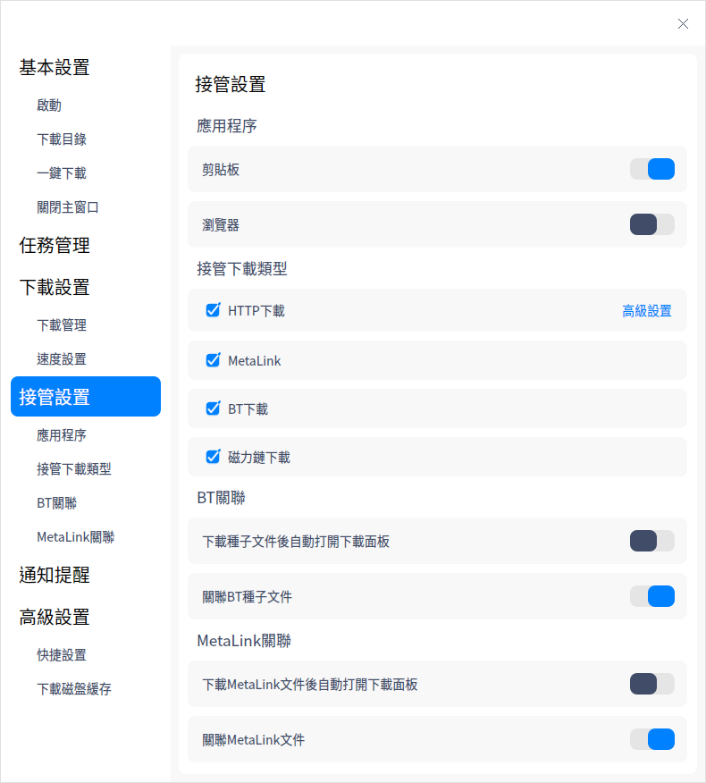
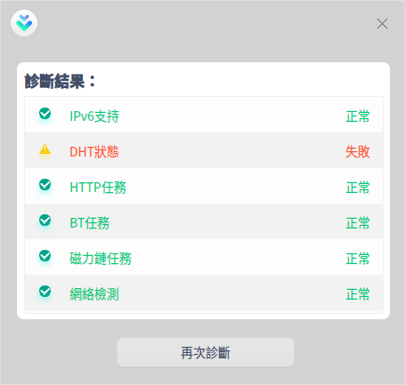

# 下載器|downloader|

## 概述

下載器是一個簡單易用的網路資源下載工具，支持多種網路下載協議。

## 使用入門

透過以下方式執行或關閉下載器，或者建立下載器的捷徑。

### 執行下載器

1. 點擊桌面底部的 ，進入啟動器介面。
2. 上下滾動滑鼠滾輪瀏覽或透過搜尋，找到下載器  點擊執行。
3. 右鍵單擊 ，您可以：
 - 點擊 **建立桌面捷徑**，在桌面建立捷徑。
 - 點擊 **釘選到Dock**，將應用程式固定到Dock。
 - 點擊 **開機啟動**，將應用程式添加到開機啟動項，在電腦開機時自動執行該應用。

### 關閉下載器

- 在下載器介面點擊  ，關閉下載器。
- 在任務欄右鍵單擊 ，選擇 **全部關閉**  來關閉下載器。
- 在下載器介面點擊 ，選擇 **離開** 來關閉下載器。

## 操作介紹

### 添加任務

#### 透過下載連結添加任務

1. 在下載器介面單擊添加任務按鈕，彈出建立下載任務視窗。

   

2. 輸入下載網址，選擇下載的文件、類型及儲存路徑後，單擊 **確定**，則任務建立成功。

   > 說明：可同時添加多個連結，需確保每行只有一個連結。

#### 透過BT文件建立下載任務

1. 透過BT文件建立下載任務，有以下方式：

   - 雙擊BT文件時，彈出建立下載任務視窗。如果主選單設定介面中「關聯BT種子文件」功能關閉，雙擊BT種子文件時就不會建立下載任務。
   - 在建立下載任務介面，將BT文件拖拽到地址框。
   - 在建立下載任務介面單擊 ，彈出檔案管理器視窗，選擇需要的BT文件。

2. 選擇下載的文件、類型及儲存路徑後，單擊 **立即下載**，則任務建立成功。

#### 透過MetaLink文件建立下載任務

1. 透過MetaLink文件建立下載任務，有以下方式：

   - 雙擊MetaLink文件時，彈出建立下載任務視窗。如果主選單設定介面中「關聯MetaLink文件」功能關閉，雙擊BT種子文件時就不會建立下載任務。
   - 在建立下載任務介面，將MetaLink文件拖拽到地址框。
   - 在建立下載任務介面單擊 ，彈出檔案管理器視窗，選擇MetaLink文件。

2. 選擇下載的文件、類型及儲存路徑後，單擊 **立即下載**，則任務建立成功。

### 搜尋任務

在下載器介面，單擊搜尋按鈕，輸入關鍵字搜尋相下載任務。

### 正在下載

主要顯示正在下載的文件列表，包括任務名稱、大小及狀態，還可以對勾選的任務進行操作，以下介紹單個任務的操作項。

>  說明：勾選單個和多個任務的操作項不同，請以實際情況為準。

**暫停**：單擊暫停按鈕  或右鍵選擇 **暫停** 後，文件暫停下載。

**開始**：如果想要繼續下載，單擊開始按鈕   或右鍵選擇 **開始** 後，之前暫停下載文件則會繼續下載。

**優先下載**：如果目前下載任務數大於設定的最大下載任務數，未開始下載（排隊及暫停狀態）的任務才有「優先下載」的選項。設定最大下載任務數的詳細操作請參閱 [任務管理](#任務管理)。

**刪除**：單擊刪除按鈕  或右鍵選擇 **刪除** 後，可刪除正在下載的文件，被刪除的文件會被放到回收站。如果勾選 **同時刪除本機文件**，本機文件也將被刪除。

**徹底刪除**：右鍵選中後，被刪除的文件不會被放到回收站，且本機文件將被刪除。

**複製下載連結**：右鍵選中後，可複製下載連結重新下載或共享給其他人。

**打開資料夾**：右鍵選中後，介面直接跳轉到下載文件所在的資料夾。

### 下載完成

主要顯示下載完成的文件列表，包括檔案名、大小及完成時間，還可以對勾選的任務進行操作，以下介紹單個任務的操作項。

>  說明：勾選單個和多個任務的操作項不同，請以實際情況為準。

**重新下載**：右鍵選中後，重新下載該文件，並刪除原來的文件。

**打開**：單擊打開按鈕  或右鍵選擇 **打開** 後，可打開該文件。

**打開資料夾**：單擊打開資料夾按鈕  或右鍵選擇 **打開資料夾** 後，介面直接跳轉到文件所在的資料夾。

**重新命名**：右鍵選中後，可對下載的文件重新命名。

**移動到資料夾**：右鍵選中後，可將下載的文件移動到指定的資料夾。

**刪除**：單擊刪除按鈕  或右鍵選擇 **刪除** 後，可刪除已下載的文件，被刪除的文件會被放到回收站。如果勾選 **同時刪除本機文件**，本機文件也將被刪除。

**徹底刪除**：右鍵選中後，被刪除的文件不會被放到回收站，且本機文件將被刪除。

**複製下載連結**：右鍵選中後，可複製下載連結重新下載或共享給其他人。

### 下載失敗

當文件下載失敗時，可嘗試重新下載。如果還是下載失敗，可能是下載連結問題、儲存路徑空間不夠或無網路等原因，具體以實際情況為準。

### 回收站 

主要顯示被刪除的文件列表，包括檔案名、大小及刪除時間，還可以對勾選的任務進行操作，以下介紹單個任務的操作項。

>  說明：勾選單個和多個任務的操作項不同，請以實際情況為準。

**還原**：單擊還原按鈕  或右鍵選擇 **還原** 後，可還原該文件，還原後的文件會被放到下載完成列表中。

**重新下載**：右鍵選中後，可重新下載該文件。

**打開**：右鍵選中後，可打開該文件。

**打開資料夾**：右鍵選中後，介面直接跳轉到文件所在的資料夾。

**複製下載連結**：右鍵選中後，可複製下載連結重新下載或共享給其他人。

**刪除**：單擊刪除按鈕  或右鍵選擇 **刪除** 後，可刪除回收站中的文件。如果勾選 **同時刪除本機文件**，本機文件也將被刪除。

**徹底刪除**：右鍵選中後，被刪除的文件不會被放到回收站，且本機文件將被刪除。

**清空**：單擊清空按鈕 或右鍵選中 **清空** 後，可清空回收站中的所有文件。

## 主選單

在主選單中，您可以進行下載設定、使用下載診斷工具、切換窗口主題、查看說明手冊等操作。

### 設定
#### 基本設定

**啟動**：主要設定程序啟動的相關項。

- 開機啟動：開啟此項後，當電腦開機時，自動啟動下載器程序。
- 啟動後自動開始未完成的任務：開啟此項後，每當啟動下載器時，自動開始正在下載列表中沒有下載完的任務

**下載目錄**：主要設定下載目錄的相關項。

- 預設目錄：從檔案管理器中選擇一下文件夾，作為默認下載路徑，此後每次創建下載任務時，都以此路徑為默認下載路徑。
- 上次使用目錄：創建下載任務時，下載路徑預設為上次下載時選擇的路徑 。

**一鍵下載**：開啟一鍵創建新任務功能後，單擊下載連結或打開BT文件時，不彈出下載器界面，直接建立下載任務。

**關閉主視窗**：

- 選擇 **最小化到系統工具列**，關閉主視窗時，應用將隱藏到系統工具列。
- 選擇 **退出**，關閉主視窗時直接退出應用。
- 選擇**每次詢問**，每次關閉主視窗時會彈出確認彈框。

#### 任務管理

主要對下載的任務進行設定，可以選擇同時下載最大任務數，下載完成後自動打開、自動將低速任務移動至隊尾等。

#### 下載設定

**下載管理**：設定原始地址執行緒數，選擇範圍是1～10。全域最大同時下載資源數預設為500，開啟後可以自行設定。

**速度設定**：選擇全速下載或限速下載，限速下載可以設定最大下載限速、最大上傳限速和限速時段。

#### 接管設定

**應用程式**：目前支援的接管物件為剪下板和瀏覽器，只有開啟開關時，才會生效。當有下載連結被複製到剪貼簿或在瀏覽器單擊下載連結時，啟動下載器並自動建立下載任務。

**接管下載類型**：在有接管物件的時候才能選擇接管下載類型，目前支援 HTTP下載、MetaLink、BT下載和磁力鏈下載。只有當複製或單擊的連結為選中的類型時，才會建立下載任務。

單擊HTTP下載旁邊的**進階設定**，可以編輯下載文件副檔名及不接管的網站。

**BT關聯**：

   - 下載種子文件後自動打開下載面板：此功能預設關閉。開啟後，當下載BT種子文件時，自動啟動下載器並建立下載任務。
   - 關聯BT種子文件：此功能預設開啟，雙擊BT種子文件時，彈出建立下載任務視窗，選擇下載的文件類型。

**MetaLink關聯**：

   - 下載Metalink文件後自動打開下載面板：此功能預設關閉。開啟後，當下載Metalink文件時，自動啟動下載器並建立下載任務。
   - 關聯MetaLink文件：此功能預設開啟，雙擊Metalink文件時，彈出建立下載任務視窗，選擇下載的文件類型。

#### 通知提醒

當有任務狀態變更時，透過系統通知來提醒您任務狀態變更內容 ，具體操作請參閱 [通知設定](dman:///dde#通知設定)。

#### 進階設定

可打開/關閉「建立任務時顯示主介面」。

可設定下載磁碟快取的大小，磁碟快取越大，下載速度越快，占用電腦資源越多。

#### 還原預設值

單擊 **還原預設值** ，復原預設設定。

### 下載完成後

下載完成後，可以選擇 **關機**、**休眠** 或 **退出**。例如為了錯開網路使用高峰，可以在下班前建立下載任務，並設定下載完成後自動關機。

### 診斷工具

主要診斷是否支援IPv6協議、DHT狀態、下載類型任務訊息及網路環境。

### 主題

視窗主題包含亮色主題、暗色主題和系統主題。

1. 在下載器介面，點擊 。
2. 點擊 **主題**，選擇一個主題顏色。

### 說明

查看說明手冊，進一步了解和使用下載器。

1. 在下載器介面，點擊 。
2. 點擊 **說明**。
3. 查看下載器的說明手冊。

### 關於

1. 在下載器介面，點擊 。
2. 點擊 **關於**。
3. 查看下載器的版本和介紹。

### 離開

1. 在下載器介面，點擊 。
2. 點擊 **離開**。

